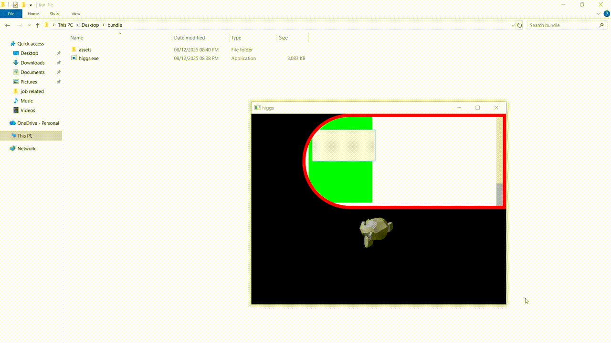

# Higgs Engine

Higgs is a lightweight C++ graphics/game engine built using Vulkan.  
Currently, development is focused on the custom UI framework, which aims to achieve react ergonomic with native performance.

---

---

## Download

1. Open the **Releases** section
2. Download the latest `.rar`, `.tar`
3. Extract anywhere
4. Run **higgs/.exe**
5. If Windows warns you:
   - Click **More info**
   - Click **Run anyway**

**Platform:** Windows only for now.

---

## UI Framework (Current Focus)

The majority of active development is directed at the UI framework, which acts similarly to a small HTML/CSS layout and rendering engine.

## Implemented

### **Tree-Based UI Architecture**

- DOM-like tree of nodes
- Parent → child hierarchy
- Cascading/inherited style properties

### **CSS-Inspired Style System**

- Centralized style objects manager with support for Id, Class, Tag, and Inline based identifiers plus cascading
- ~8% of CSS properties implemented (foundational subset)
- Partial inheritance rules
- Pseudo-style support (hover, focus, active)

### **Layout System (3-Pass Pipeline)**

Layout currently operates in **three passes**:

1. **Intrinsic Sizing Measure**: bottom-to-top compute the intrinsic sizing for each node with undefined dimensions.
2. **Resolve And Clamp Dimensions**: top-to-bottom resolve node dimensions and apply constraints
3. **Position**: calculate coordinates

### **Displays**

**Stack**

- 'Alternative' to CSS's `block` display. Child nodes do not control their own positioning; layout is determined by the parent.

**Grid**

- **Alignment**: `justify-content`, `align-content`, `justify-items`, `align-items`, `justify-self`, `align-self`
- **Auto-Flow / Auto-Density**: support for column/row major and sporadic/dense placement
- **Track sizing**: fixed (`px`), fractional (`fr`), and intrinsic (`fit-content`) tracks
- **Gaps**: configurable row and column gaps
- **Span and placement**: multi-column/multi-row spanning and manual placement
- **Overlapping**: items can overlap tracks if explicitly positioned

### **Borders**

- Smooth border creation with cubic bezier curves
- Dynamic border widths with interpolation
- Dynamic corner roundness
- Dynamic side coloring

### **Overflow + Clipping**

- GPU stencil-test pipeline for perfect clipping
- Correct overflow masking behavior
- Currently overflow-y scroll logic

### **Scroll System**

- Wheel input handling
- Scroll bounds and clamping
- Vertical scroll only (`overflow-y: scroll`)
- **No animation / momentum yet**
- **No horizontal scrolling yet**

---

## Upcoming UI Work

### **Scrolling**

- Horizontal scroll
- Smooth interpolation/momentum

### **Text Rendering And a Text Layout System**

- Glyph rendering
- Font loading
- Unicode shaping
- Text layout + inline formatting

### **Virtualized DOM-Like Optimization**

- Render-only visible children
- Cull large UI trees
- Virtualized list/scroll performance

### **HTML & CSS Codegen**

- Custom tokenizer and parser
- Map parsed structure into the engine’s UI nodes
- CSS cascading and specificity rules (subset)

### **CPPX Codegen**

- Compile-time JSX-like components called `cppx`

### **Reactive System**

- A signal based reactive system

---

## 3D Engine (Paused)

The underlying 3D renderer remains functional but is **not** the current development target.

Included:

- Vulkan rendering pipeline
- Depth testing & MSAA
- Directional lighting
- Scene graph
- Custom math library (Vec/Mat/Quat)
- Custom OBJ + GLB loader
- PNG/TGA/BGA image loading
- Camera + input system
- Resource and material managers

---

## Future Engine Work (Long-Term)

- Full PBR materials (parsing only implemented)
- Shadow mapping
- Ray-tracing experiments
- Scene & transform editor
- Physics system
- Engine→"game executable" optimized build pipeline
- UI + 3D integrated editor interface

---

## Project Status

This project's source is **private**, experimental, and actively evolving.  
It serves primarily as an R&D platform for custom UI engines, rendering pipelines, and engine architecture exploration.
