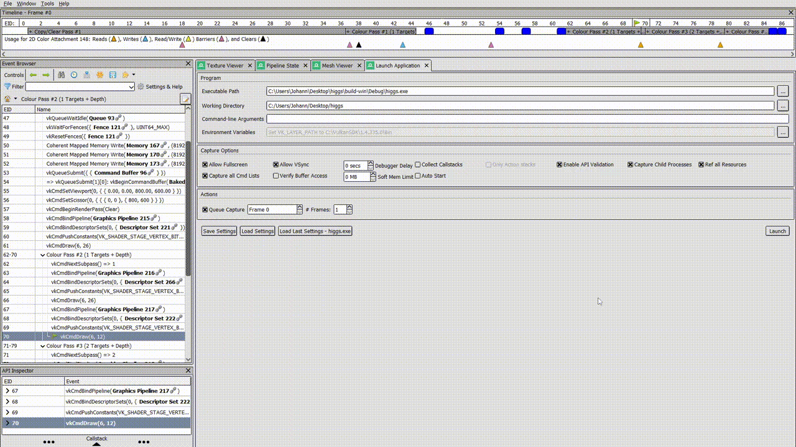

# Higgs

Higgs is a lightweight C++ graphics, UI, and game engine built solely with Vulkan, GLSL, GLFW, nlohmann/json, and the STL (also with the help of RenderDoc).  
Current development is focused on the custom UI framework, which aims to provide React-like ergonomics with native performance.

---

NOTE - this video demonstrates the various specs of the `Grid` display, WBOIT, OI perfect composite clipping, z-testing, and scrolling.

---

## Download

1. Open the Releases section  
2. Download the latest `.rar`  
3. Extract anywhere  
4. Run `higgs.exe`  
5. If Windows shows a warning:
   - Click More info  
   - Click Run anyway

Platform: Windows only for now.

---

## UI Framework (Current Focus)

Most active development is directed at the GPU-accelerated UI framework.

### The UI Rendering Pipeline

The UI rendering pipeline consists of 4 subpasses and 7 instanced draw commands (the first three each have one draw command for rects and a separate one for glyphs).

- Clip Mask Subpass: Draws into a window-extent texture the bit mask of each node, pre-baked depending on cascading and passed via an SSBO. The masks are logically blended via `OP_OR` to create an encoding of where children of a node are allowed to be rendered.
- Opaque Subpass: Depth test + write. Draws rects and glyphs directly to the swapchain where `alpha == 1`, meaning no transparency.
- Alpha/Transparency Subpass: Depth tests to skip opaque fragments processing and only process alpha fragments. Draws onto two separate attachments: the accumulation attachment and the revealage attachment.
- Resolve Subpass: Combines the accumulation and reveal attachments and draws to the swapchain image with alpha blending.

The drawing logic is purely shader-based, allowing for instancing. Various properties concerning each rect are passed via an SSBO to the shader, including border corner radii, side widths, background and border colors, resolved z values, and clipping references.

The main logic behind rendering a rect instance is categorizing whether a fragment lies outside the border or outside the content. More precisely, the border is composed of two paths:

- The outer border consists of connected perfect quarter circles and uses a simple performant analytically perfect signed distance calculation.
- The inner border is a quarter ellipse and uses a good approximation method.

Finally, everything between the inner and outer borders is painted with the border color, and everything inside (not outside) the inner border is painted with the background color.

---

### Resources

The engine module owns a centralized resource manager class that manages all GPU resources and is responsible for allocation, deletion, and fetching of GPU-abstracted classes. This guarantees modularity, controls lifecycle (avoids dangling pointers and works with handles), and potentially allows for concurrent loading.

The UI rendering pipeline utilizes:

- An SDF atlas class that holds a `Unicode` to `SDF sprite bbox` mapping for glyph rendering  
- A render pass  
- Multiple shader modules  
- Multiple descriptor set layouts, pipeline layouts, and descriptor sets  
- A graphics pipeline for each subpass  
- Various order-agnostic SSBOs holding instance data structs for rects and glyphs  
- Framebuffers  
- Image attachments (clip mask, accumulation, reveal)

---

### Custom Work

As mentioned, Higgs utilizes minimal dependencies. As such, a lot of foundational logic is custom. This is mainly for ownership and learning, providing an end-to-end understanding of the system.

This includes:

#### Custom math library

- Templated linear algebra types (`Vec`, `Mat`, `Quat`)  
- Ear-clipping triangulation  
- Hole removal from simple polygons  
- Geometric tests (point-in-shape for Bézier curves, polygons, triangles, circumcircles, relative orientation, winding order, etc.)  
- Delaunay-optimized N-point triangulation creation  
- StarEdges creation and optimization from a random initial triangulation  
- Bézier curve resolution (uniform and adaptive error-bounded)  
- Bézier path ribbon generation with per-curve join logic  
- Affine transformation helpers (translation, rotation, scaling)  
- Floating-point comparator utilities  

#### Custom file parsers

- OBJ  
- GLB  
- PNG  
- TGA  
- BMP  
- TTF  

#### Custom text rendering

- LRU-cached glyph SDF atlas  
- Glyph rendering via sampled SDF sprites  

#### A very early signal-based reactive system.

- Currently used to mark the swapchain extent as a `Signal` object, bound to two callbacks that recreate the appropriate resources on resize.
- `Signal` class: defines a signal object with callback ownership supporting both immediate and deferred execution. Signals should be initialized within an `Observable` to define their lifetime.
- `Derived` class: represents a value derived from multiple signals. It should also be initialized within an `Observable` to ensure proper lifetime management.
- `Observable` class: binds reactive objects to a scope, allowing safe destruction of signals, derived values, and their associated callbacks.

And minor engine systems such as the base vulkan renderer, resource manager, etc.

---

### Tree-Based UI Architecture

- DOM-like node tree  
- Parent-to-child hierarchy  
- Cascading and inherited style properties  

---

### CSS-Inspired Style System

- Centralized style object manager supporting ID, Class, Tag, and Inline selectors with cascading  
- Core layout and styling implemented: display, positioning, box model (padding, margin, borders), basic text styling, overflow logic, etc.  
- Partial inheritance rules  
- Pseudo-style support (`hover`, `focus`, `active`)  

---

### Layout Calculation Pipeline

Originally a 3-pass pipeline, it was split between width and height (6 passes) since text intrinsic height depends on the resolved width.

1. Intrinsic Sizing Measure: Bottom-to-top computation of intrinsic sizes for nodes with undefined dimensions  
2. Resolve and Clamp Dimensions: Top-to-bottom resolution and constraint application  
3. Position: Top-to-bottom final coordinate calculation  

---

### Displays

#### Stack

- Alternative to CSS block display  
- Children do not control their own positioning  
- Layout is parent-driven  

#### Grid

- Alignment: `justify-content`, `align-content`, `justify-items`, `align-items`, `justify-self`, `align-self`  
- Auto-flow and auto-density with row- or column-major placement, sparse or dense packing  
- Track sizing with fixed (`px`), fractional (`fr`), and intrinsic (`fit-content`) tracks  
- Configurable row and column gaps  
- Multi-row and multi-column spanning with optional manual placement  
- Explicit overlap support when positioned  

---

### Scroll System

- Wheel input handling  
- Scroll bounds and clamping  
- Vertical scrolling only (`overflow-y: scroll`)  

---

## Major Milestones Planned

#### HTML and CSS Codegen

- Custom tokenizer and parser  
- Mapping parsed structures into UI nodes  

#### CPPX Codegen

- Compile-time and potentially runtime JSX-like components named `cppx`  

---

## Future Engine Work (Long-Term)

- PBR  
- Global illumination  
- Shadow mapping  
- Ray tracing  
- Scene and transform editor  
- Physics system  
- Engine-to-game executable optimized build pipeline  
- Integrated UI and 3D editor interface  

---

## Project Status

This project's source is private, experimental, and actively evolving.  
It primarily serves as an R&D platform for custom UI systems, rendering pipelines, and engine architecture exploration.